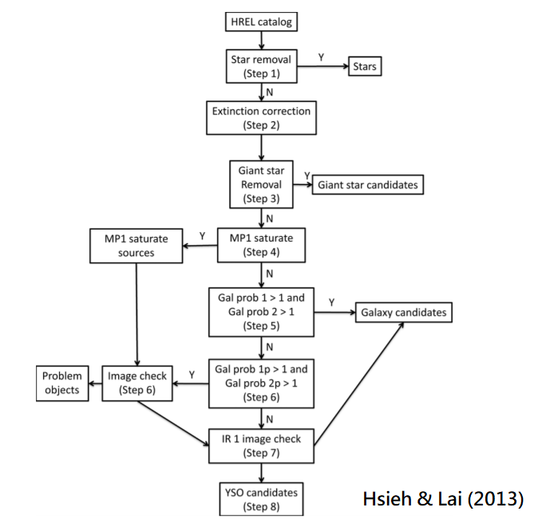

# **YSO Hunters**
## **I.Introduction**
- Distinguishing Galaxies and Young Stellar Objects (YSOs) from a database solely containing magnitudes has been
proved to be a difficult task, since the physical composition of both types of objects are similar but with different
amount (Harvey et al. 2006). Hsieh & Lai (2013) found that YSOs can stand out from Galaxies in Multi-dimensional
Magnitude Space, and thus can be separated straightforwardly. Unfortunately, the computer memory required by
the Multi-dimensional Magnitude Space method is too much for a database with 8 photometric bands, so Hsieh & Lai
(2013) used two 5-dimensional arrays instead. Here we attempt to reduce the memory requirement by choosing the
proper magnitude range (mag1, mag2),so that mag<mag1 are (almost) certainly to be YSOs and mag>mag2 are all
Galaxies. Thus, the grid point required by the Multi-dimensional Magnitude Space will be greatly reduced. Our results
will test whether the two 5-dimensional arrays chosen in Hsieh & Lai (2013) are adequate.

## **II.Goal**
- Repeat the procession of Hsieh & Lai (2013) and get the same result
- Use marginal plane on multi-dimensional space to save RAM
- Make the program construct mroe dimension space at same time

## **III.Improvement**
- Make all processions be automatic (SOP Program)
- Reduce the errors about extinction correction
- Use marginal curved surface instead of the marginal plane (position support vector)

## **IV.Step**

## **V.Problem**
- Inchone's YSO_table(Flux in all_candidatas.tbl) differ from our data source(Glue_7_Clouds.tbl)
  - Because we did not consider the extinction

## **VI.Work log**
- 07/19
	- Find the possible cause about problem 1 : We did not de-redden the whole c2d catalog
- 07/24
	- To realize the knowledge about extinction
- 07/25
	- Learn to use astropy to read the data from ds9
- 07/26
	- Discussion with Inchone Hsieh :
		- How to remove the Av from c2d sources
		- What are 'Image check '(step6) and 'IR1 image check'(step7)
- 08/06
	- check CHA_II catalog after extinction correction :
		- HREL is different from Hsieh's catalog (He may use Full table)
		- One candidate is missing in HREL table (Check Hsieh's table, that one is not in HREL table) 
- 08/07
	- Check data_type from Inchone's Chamaleon_RemoveStar_catalog (can_iden.tbl)
	- Remove star form every cloud catalog
- 08/14
    - Uncertainties Package (python's package to calculate uncertainties)
    - Maybe go wrong with log (since it uses Gaussian to fit, the upper and the lower are symmetric )
    - It can't use numpy or math (Use Uncertianties its own log etc.)
- 08/27
	- To write the each part of program about SOP
- 09/02
	- SOP program for 
		- (1)Star_Removal complete
		- (2)Extinction_Correction complete
		- (3)Gal_Prob calulate and sort complete (but still improving)
	- Program of producing image check for saturate sources is still missing.(maybe write a new one)
- 09/04
	- SOP program for Gal_Prob calculate and sort complete and improved
- 09/06
	- SOP program for MP1_Saturate(Step 4) is almost complete but with some questions
		- mosaics of OPH has different file name compared to CHA_II, LUP ...
		- what's difference  between file name with an A and BCD ?
	- SOP program for Image_Check(Step 7) confronts same questions as MP1_saturate does.
- 09/18
	- SOP programs for individual steps are OK.
	- program to run all SOP program is OK with step1~step6 (but Saturate_Check, Image_Check are still trying.)
- 09/19
	- program to run all SOP program is OK with step1~step (including Image_Check)
	- still working on distinguish Saturate source after Gal_Prob check
- 10/07
	- SER's Yso candidates have some problems
		- Hsieh's Yso candidates are not fully included in our solid yso result(before image check)
		- not Hsieh's but ours, not ours but Hsieh both are not zero.
	- plot SER's Yso candidates onto MP1 image, IR1 image
- 10/09
	- SER's problems are found
		- Extinction correction didn't work due to the wrong extinction map.
		- trying to fix
    - Use PNICER to create a new extinction map.
    
## **VII.Data Sources**
- **Catalog from c2d & SWIRE :**
  - Molecular Clouds HREL catalog :
    - /data/public/spitzer/c2d/data.spitzer.caltech.edu/popular/c2d/20071101_enhanced_v1
  - Extinction Map (Av table) :
    - /cosmo/users/inchone/Remove_Av_sources_in_whole_clouds/Old/New_version/Backup_Av_table
  - Mosaic for Saturate Check
    - from Hsieh:
      - /data/users/inchone/Perseus/oldold/mosaic
    - from spitzer database:
      - /data/public/spitzer/c2d/data.spitzer.caltech.edu/popular/c2d/20071101_enhanced_v1/CHA_II/MOSAICS

- **Programs from Inchone Hsieh :**
  - Make multi-D space:
    - /cosmo/users/inchone/Remove_Av_sources_in_whole_clouds/SWI_c2d_PSD_new_process2_multi-dim_version/J_MP1_plus_IR1_MP1_methed/c2d_SWIRE_IR1-MP1
    - /cosmo/users/inchone/Remove_Av_sources_in_whole_clouds/SWI_c2d_PSD_new_process2_multi-dim_version/J_MP1_plus_IR1_MP1_methed/c2d_SWIRE_J-MP1    
  - Galaxy Probability:
    - /cosmo/users/inchone/Remove_Av_sources_in_whole_clouds/SWI_c2d_PSD_new_process2_multi-dim_version/J_MP1_plus_IR1_MP1_methed
  - Galaxy Probability (p):
    - /cosmo/users/inchone/Remove_Av_sources_in_whole_clouds/SWI_c2d_PSD_new_process2_multi-dim_version/J_MP1_plus_IR1_MP1_methed/Chamaeleon/YSO_Selection
  - Remove Av:
    - /cosmo/users/inchone/Remove_Av_sources_in_whole_clouds/Old/New_version/
  - Saturate Check:
    - /cosmo/users/inchone/Remove_Av_sources_in_whole_clouds/SWI_c2d_PSD_new_process2_multi-dim_version/J_MP1_plus_IR1_MP1_methed/Perseus
  - Get IR Image:  
    - /cosmo/users/inchone/Remove_Av_sources_in_whole_clouds/Old/multi-dim_version/Saturate_and_Band_fill_correct/Chamaleon/Saturate_no_count/getfits.py
  - Image Check:
    - /cosmo/users/inchone/Remove_Av_sources_in_whole_clouds/SWI_c2d_PSD_new_process2_multi-dim_version/J_MP1_plus_IR1_MP1_methed/Perseus/YSO_Selection/notPSF1_check

## **VIII.Reference**
**Hsieh and Lai's Result vs Evan's Result :**

**Hsieh and Lai's missing YSOs :**

**Catalog Classification from c2d legacy project :**

