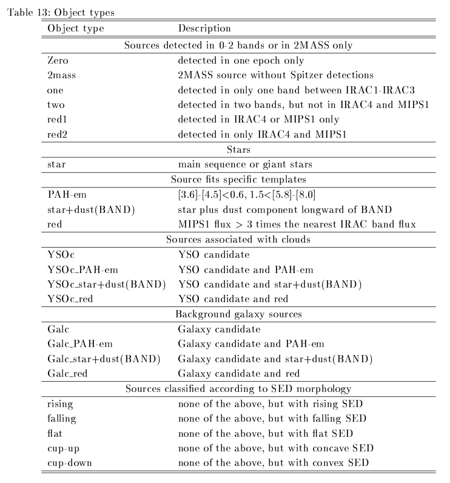

# **YSO Hunters**
## **I.Introduction**
Distinguishing Galaxies and Young Stellar Objects (YSOs) from a database solely containing magnitudes has been proved to be a difficult task, since the physical composition of both types of objects are similar but with different amount (Harvey et al. 2006). Hsieh & Lai (2013) found that YSOs can stand out from Galaxies in Multi-dimensional Magnitude Space, and thus can be separated straightforwardly. Unfortunately, the computer memory required by the Multi-dimensional Magnitude Space method is too much for a database with 8 photometric bands, so Hsieh & Lai (2013) used two 5-dimensional arrays instead. Here we attempt to reduce the memory requirement by choosing the proper magnitude range (mag1, mag2),so that mag\<mag1 are (almost) certainly to be YSOs and mag\>mag2 are all Galaxies. Thus, the grid point required by the Multi-dimensional Magnitude Space will be greatly reduced. Our results will test whether the two 5-dimensional arrays chosen in Hsieh & Lai (2013) are adequate.

## **II.Goal**
- Repeat the procession of Hsieh & Lai (2013) and get the same result
- Use marginal plane on multi-dimensional space to save RAM
- Make the program construct mroe dimension space at same time

## **III.Improvement**
- Make all processions be automatic (SOP Program)
- Reduce the errors about extinction correction
- Use marginal curved surface instead of the marginal plane (position support vector)

## **IV.Step**


## **V. How To Use SOP Programs**
1. Add Directories started with SOP to current working environments
  - e.g. In .cshrc file:
    ```
    setenv PATH ${PATH}:/home/jordan/YSO_PROJECT/YSO_Hunters/SOP_Toolkit
    setenv PATH ${PATH}:/home/jordan/YSO_PROJECT/YSO_Hunters/SOP_Program_Preset
    setenv PATH ${PATH}:/home/jordan/YSO_PROJECT/YSO_Hunters/SOP_Program_5D_method
    setenv PATH ${PATH}:/home/jordan/YSO_PROJECT/YSO_Hunters/SOP_Program_6D_method
    setenv PATH ${PATH}:/home/jordan/YSO_PROJECT/YSO_Hunters/SOP_Program_Extinction_Check
    ```
2. Revise Locations of Some Programs if **No such file** error happens.
  - e.g. Some Locations May be needed to Revised
    - Location where multi-D Galaxy Probability Array stored
    - Location where Gal_SOP_EXECUTION.py calling other programming
3. Standard Sequence for Execution:
    1. SOP_Execution_Preset.py
    2. SOP_Execution_5D_method.py
    3. SOP_Execution_6D_method.py
    4. SOP_Execution_Extinction_check.py
      - **Note This Command Must Execute inside Specific Binsize Directory**
  
## **VI.Data Location**
- **Catalog from c2d & SWIRE :**
  - Molecular Clouds HREL catalog :
    - /data/public/spitzer/c2d/data.spitzer.caltech.edu/popular/c2d/20071101_enhanced_v1
  - Extinction Map (Av table) :
    - /cosmo/users/inchone/Remove_Av_sources_in_whole_clouds/Old/New_version/Backup_Av_table
  - Mosaic for Saturate Check
    - from Hsieh:
      - /data/users/inchone/Perseus/oldold/mosaic
    - from spitzer database:
      - /data/public/spitzer/c2d/data.spitzer.caltech.edu/popular/c2d/20071101_enhanced_v1/CHA_II/MOSAICS
- **Data for new alogorithm :**
    - new binsize galaxy probability
      - /home/ken/new_mg/GPV_SOP_Program
- **Programs from Inchone Hsieh :**
  - Make multi-D space:
    - /cosmo/users/inchone/Remove_Av_sources_in_whole_clouds/SWI_c2d_PSD_new_process2_multi-dim_version/J_MP1_plus_IR1_MP1_methed/c2d_SWIRE_IR1-MP1
    - /cosmo/users/inchone/Remove_Av_sources_in_whole_clouds/SWI_c2d_PSD_new_process2_multi-dim_version/J_MP1_plus_IR1_MP1_methed/c2d_SWIRE_J-MP1    
  - Galaxy Probability:
    - /cosmo/users/inchone/Remove_Av_sources_in_whole_clouds/SWI_c2d_PSD_new_process2_multi-dim_version/J_MP1_plus_IR1_MP1_methed
  - Galaxy Probability (p):
    - /cosmo/users/inchone/Remove_Av_sources_in_whole_clouds/SWI_c2d_PSD_new_process2_multi-dim_version/J_MP1_plus_IR1_MP1_methed/Chamaeleon/YSO_Selection
  - Remove Av:
    - /cosmo/users/inchone/Remove_Av_sources_in_whole_clouds/Old/New_version/
  - Saturate Check:
    - /cosmo/users/inchone/Remove_Av_sources_in_whole_clouds/SWI_c2d_PSD_new_process2_multi-dim_version/J_MP1_plus_IR1_MP1_methed/Perseus
  - Get IR Image:  
    - /cosmo/users/inchone/Remove_Av_sources_in_whole_clouds/Old/multi-dim_version/Saturate_and_Band_fill_correct/Chamaleon/Saturate_no_count/getfits.py
  - Image Check:
    - /cosmo/users/inchone/Remove_Av_sources_in_whole_clouds/SWI_c2d_PSD_new_process2_multi-dim_version/J_MP1_plus_IR1_MP1_methed/Perseus/YSO_Selection/notPSF1_check

## **VII.Reference**
**Hsieh and Lai's Result vs Evan's Result :**

**Hsieh and Lai's missing YSOs :**

**Catalog Classification from c2d legacy project :**

