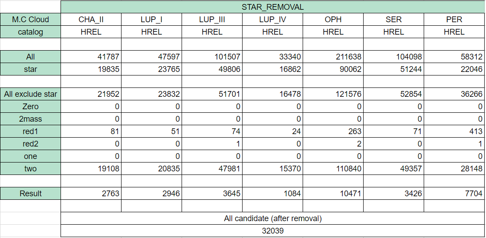

# **Star removal(Step 1)**
## **I.Introduction**

- The main-sequence stars were first removed by SED fitting.The fitting process is the same as that in Harvey et al.(2007b) and Evans et al. (2007), which select stars with reddened stellar atmosphere SED templates.
## **II.Step**
- Use objecttype on c2d catalog
  - Remove star and giant star (labeled as 'star')
  - Remove source detected in
    - 0-2 bands (labeled as 'zero, one, two, red1, red2')
    - only 2mass (labeled as '2mass')
## **III.Result**

## **IV.Reference**

