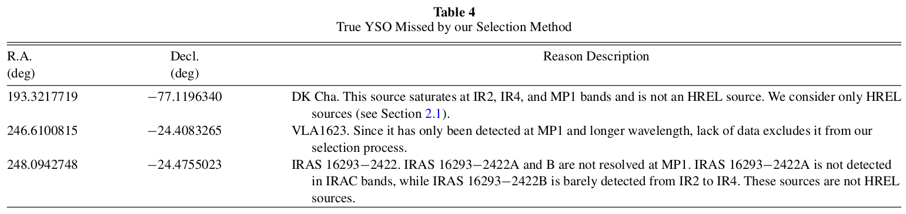

# **Documentation**

## **I.Step**

- ### **Hsieh & Lai (2013) Steps**

- ### **This Work Steps**

## **II.Data Location**
- ### **Catalog from c2d & SWIRE :**
  - Molecular Clouds HREL catalog :
    - /data/public/spitzer/c2d/data.spitzer.caltech.edu/popular/c2d/20071101_enhanced_v1
  - Extinction Map (Av table) :
    - /cosmo/users/inchone/Remove_Av_sources_in_whole_clouds/Old/New_version/Backup_Av_table
  - Mosaic for Saturate Check
    - from Hsieh:
      - /data/users/inchone/Perseus/oldold/mosaic
    - from spitzer database:
      - /data/public/spitzer/c2d/data.spitzer.caltech.edu/popular/c2d/20071101_enhanced_v1/CHA_II/MOSAICS
- ### **Data for new alogorithm :**
    - new binsize galaxy probability
      - /home/ken/new_mg/GPV_SOP_Program
- ### **Programs from Inchone Hsieh :**
  - Make multi-D space:
    - /cosmo/users/inchone/Remove_Av_sources_in_whole_clouds/SWI_c2d_PSD_new_process2_multi-dim_version/J_MP1_plus_IR1_MP1_methed/c2d_SWIRE_IR1-MP1
    - /cosmo/users/inchone/Remove_Av_sources_in_whole_clouds/SWI_c2d_PSD_new_process2_multi-dim_version/J_MP1_plus_IR1_MP1_methed/c2d_SWIRE_J-MP1
  - Galaxy Probability:
    - /cosmo/users/inchone/Remove_Av_sources_in_whole_clouds/SWI_c2d_PSD_new_process2_multi-dim_version/J_MP1_plus_IR1_MP1_methed
  - Galaxy Probability (p):
    - /cosmo/users/inchone/Remove_Av_sources_in_whole_clouds/SWI_c2d_PSD_new_process2_multi-dim_version/J_MP1_plus_IR1_MP1_methed/Chamaeleon/YSO_Selection
  - Remove Av:
    - /cosmo/users/inchone/Remove_Av_sources_in_whole_clouds/Old/New_version/
  - Saturate Check:
    - /cosmo/users/inchone/Remove_Av_sources_in_whole_clouds/SWI_c2d_PSD_new_process2_multi-dim_version/J_MP1_plus_IR1_MP1_methed/Perseus
  - Get IR Image:
    - /cosmo/users/inchone/Remove_Av_sources_in_whole_clouds/Old/multi-dim_version/Saturate_and_Band_fill_correct/Chamaleon/Saturate_no_count/getfits.py
  - Image Check:
    - /cosmo/users/inchone/Remove_Av_sources_in_whole_clouds/SWI_c2d_PSD_new_process2_multi-dim_version/J_MP1_plus_IR1_MP1_methed/Perseus/YSO_Selection/notPSF1_check

## **III.Reference**
- ### **Hsieh and Lai's Result vs Evan's Result :**

- ### **Hsieh and Lai's missing YSOs :**

- ### **Catalog Classification from c2d legacy project :**

